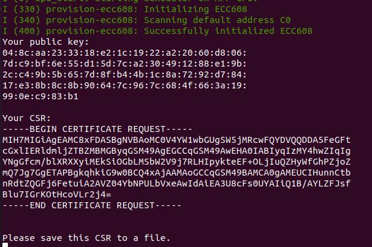

# Provision ECC608

This project can be used to generate a private key and certificate sign request (CSR) using the ATECC608A (TrustCustom) crypto chip. More information about the chip can be found here: https://www.microchip.com/wwwproducts/en/atecc608a

The project assumes you have connected your ESP32-WROOM-32 to an ECC608 through a I2C connection. The I2C address, SDA, and SCL pins are 0xC0, 27, and 33 respectively, but these are easily configurable.

## Get Started

Follow these instructions to quickly generate a private key and CSR:

- Installation instructions for ESP-IDF version release/v4.2 are here: https://docs.espressif.com/projects/esp-idf/en/release-v4.2/esp32/get-started/index.html
- Download and configure this project using the following commands:
```
git clone --recursive https://github.com/PBearson/Provision-ECC608.git
cd Provision-ECC608
idf.py menuconfig
```
- In the menu config, navigate to **Component config -> esp-cryptoauthlib** and change the I2C SDA pins and I2C SCL pins to the appropriate pinout for your setup.
- If the I2C slave address is not 0xC0, or if you do not know the address, then check the option "Scan for the ATECC608A I2C address".
- Now quit the menuconfig and build/flash the app to your ESP32:
```
idf.py build flash monitor
```

A public key and CSR will print to the console. You may save the CSR for future use in a network application (e.g., AWS IoT).

## Sample Output


